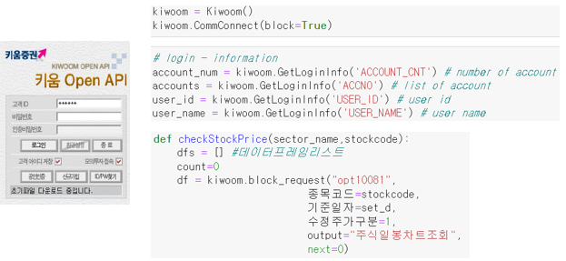
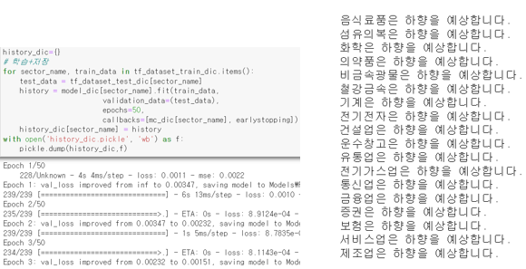

# 빨간맛

## 뉴스와 주가 데이터를 활용한 투자 참고지표 개발

### 아이디어
한국예탁결제원에 따르면, 지난해 국내 주식 투자자의 수가 1천384만 명을 돌파하였습니다. 코로나19 국면과 유동성 이슈를 거치면서 투자 열풍이 한반도를 휩쓸었고, 이제는 주식 투자가 정말 많은 사람들에게 자산 증식의 수단으로 자리잡게 되었습니다. 그러나, 개인투자자가 투자종목을 결정함에 있어서 가볍게 참고할 만한 지표가 아직은 많이 부족한 것이 사실입니다. 이에 우리는 실전 투자에 참고할 수 있는 서비스를 설계하고자 합니다.

### 개발인원 : 6명

### 프로젝트 내용 파트
#### A : 각 업종별 주요 종목을 중심으로, 주가와 관련된 데이터를 분석해 변동 추이와 이동 확률을 분석. 시가총액, 현재가, 거래량, 거래대금 등 다양한 데이터 수집해 예측 값의 정확도 향상 도모
#### B : 전날의 주요 언론사 뉴스 헤드라인 감성 분석을 통해 주가 방향성을 예측. 같은 이슈에도 업종마다 미치는 영향이 다를 수 있음을 고려해 업종별 모델 학습. 해당 업종과 직접적으로 관련된 기사 외에도 정치, 사회, 군사, 세계 등  다양한 토픽을 참조.

### 담당역할 : 파트A(주식정보 데이터 수집(API와 웹크롤링), 데이터전처리, 모델학습 및 예측, 자동화) + 카카오 챗봇 구현

### 개발환경
#### 언어 : Python
#### 서버 : AWS EC2, ubuntu
#### IDE : PyCharm, Jupyter Notebook, VS Code, Goormide
#### API : Kiwoom Open API

### 기술 스택 : Kiwoom Open API, 카카오 챗봇, BeautifulSoup, Tensorflow, LSTM 등

### 참고 사항
1. 주식 항목들의 과거부터 현재까지의 시계열 데이터를 기반으로 주식 업종별로 다음 날의 주가 상하향을 예측합니다.
2. 자동화로 수집 및 갱신을 하기위해 'goormide'이라는 Cloud기반 개발 환경에서 '항상켜두기'기능과 schedule 라이브러리를 사용합니다.

### 프로젝트 진행 순서
1. 데이터 수집 : Kiwoom Open API를 이용하여
주식 정보 수집
2. 데이터 갱신 및 전처리 : 웹 크롤링을 통한 주식 정보 병합(갱신) 및 전처리
3. 데이터 학습 및 평가 : 학습 및 예측을 통해
주가 상하향을 예측
4. 데이터 시각화 : 카카오 챗봇을 이용한 투자지표 정보 공유

### 상세과정
1. 데이터 수집 : Kiwoom Open API를 이용하여 주식 정보를 수집합니다.

2. 데이터 갱신 : 다음 날의 주가 상하향을 예측하기위해 매일 일별정보를 수집 및 갱신을 해야 합니다. 키움API를 이용하려고 했지만 goormide환경에서 호환문제가 발생하여 BeautifulSoup라이브러리를 사용하여 웹크롤링을 통해 주가정보를 수집하여 현재의 데이터를 업데이트 하였습니다. (이전data+최신data 병합)

3. 데이터 전처리 : 업종별로 존재하는 항목들을 일자별로 평균을 내서 업종별 일자의 대표값으로 지정합니다. 각 칼럼의 데이터 타입을 정수형으로 변환합니다. MInMaxScaler로 칼럼 별 정규화합니다.

4. 데이터 학습 및 평가 : 업종별 각 모델 마다 업종별 일별 데이터를 전처리 과정을 거친 후 학습을 시켜서 모델을 만듭니다. 학습한 모델을 통해 다음 날의 주가 상하향을 예측합니다.

5. 데이터 시각화 : schedule을 통해 정해진 시각마다 goormide에서 자동으로 주식데이터를 수집 및 갱신하고 모델을 학습 시켜 다음 날의 주가 상하향을 예측한 결과를 저장합니다. 카카오 챗봇을 통해 투자지표 정보를 공유합니다.

6. 데이터 시각화 - 카카오 챗봇 시연 자료 : 파트 A, B를 통합한 정보를 챗봇을 통해 정보를 공유합니다.

### 코드 파일
1. DataCollection
- 키움API를 이용하여 업종별 시가총액 Top5(해당업종의 대표성이 높다고 판단)의 항목들의 현재부터 과거까지 최대 3000일자의 항목별 주가 정보를 수집합니다.
- 원하는 피쳐를 선택해서 추출합니다.(모델학습을 통해 가장 이상적인 결과를 보인 피쳐선정)
데이터프레임 피쳐) 일자, 거래량, 시가, 고가, 저가, 종가
- 출력) df_sector.pickle, sector.pickle

2. UTDdata
다음 날의 주가 상하향을 예측하기위해 매일 일별정보를 수집 및 갱신을 해야 합니다.
- 키움API를 이용하려고 했지만 goormide환경에서 호환문제가 발생하여 BeautifulSoup라이브러리를 사용하여 웹크롤링을 통해 주가정보를 수집하여 현재의 데이터를 업데이트 하였습니다.(이전data+최신data 병합)
- 출력) df_sector_UTD.pickle

3. 전처리
- 업종별로 존재하는 Top5의 항목들을 일자별로 평균을 내서 업종별 일자의 대표값으로 지정합니다.
- 각 칼럼의 데이터 타입을 정수형으로 변환합니다.
- MInMaxScaler로 칼럼 별 정규화합니다.
- 출력) df_scaled_UTD.pickle

4. Modeling
- 업종별 각 모델 마다 Datacolletion에서 모은 업종별 3000개의 일별 데이터를 전처리 과정을 거친 후 학습을 시켜서 모델을 만듭니다.
- 출력) Models, filename_dic, history_dic Model : Conv1D + LSTM + 은닉층 + 출력층

5. TomorrowPredict
- 다음 날의 주가 상하향을 예측합니다.
- 출력) pred_dic.pickle

6. main.py
- schedule을 통해 정해진 시각마다 goormide에서 자동으로 주식데이터를 수집 및 갱신하고 모델을 학습 시켜 다음 날의 주가 상하향을 예측한 결과를 저장합니다.

7. applpication.py
- 카카오 챗봇을 통해 요청을 받고 데이터를 응답해주기 위한 파일

### 파일명
1. df_sector : 이중 딕셔너리 /  {업종명 : {항목코드: 항목 3000개의 데이터 프레임}} 
2. sector : 딕셔너리 / {업종명 : [항목코드]} 
3. df_sector_UTD : 딕셔너리 / {업종명 : {항목코드: 항목 3000개+α의 데이터 프레임}}  : 기존 3000개에서 오늘날(최신)까지 각 항목별 데이터가 추가
4. df_scaled_UTD : 딕셔너리  / {업종명 :  항목 3000개+α의 데이터 프레임}}  : df_sector_UTD의 업종별 각 항목의 데이터프레임을 일자별로 평균을 낸다음 업종별 하나의 데어터프레임으로 변경. 정규화 적용, 데이터 타입 변환
5. filename_dic : 각 모델의 체크포인트의 이름을 저장하고있는 딕셔너리
6. Models : 모델의 체크포인트 파일이 저장 디렉터리
7. history_dic : 각 업종별로 학습과정의 loss와 val_loss를 히스토그램으로 저장되어있다.
8. pred_dict : 각 업종별로 내일의 주식의 상향/하향을 예측한 문자열을 가진다.
9. logfile.log : 백그라운드로 실행된 main.py의 기록이 저장된 로그파일